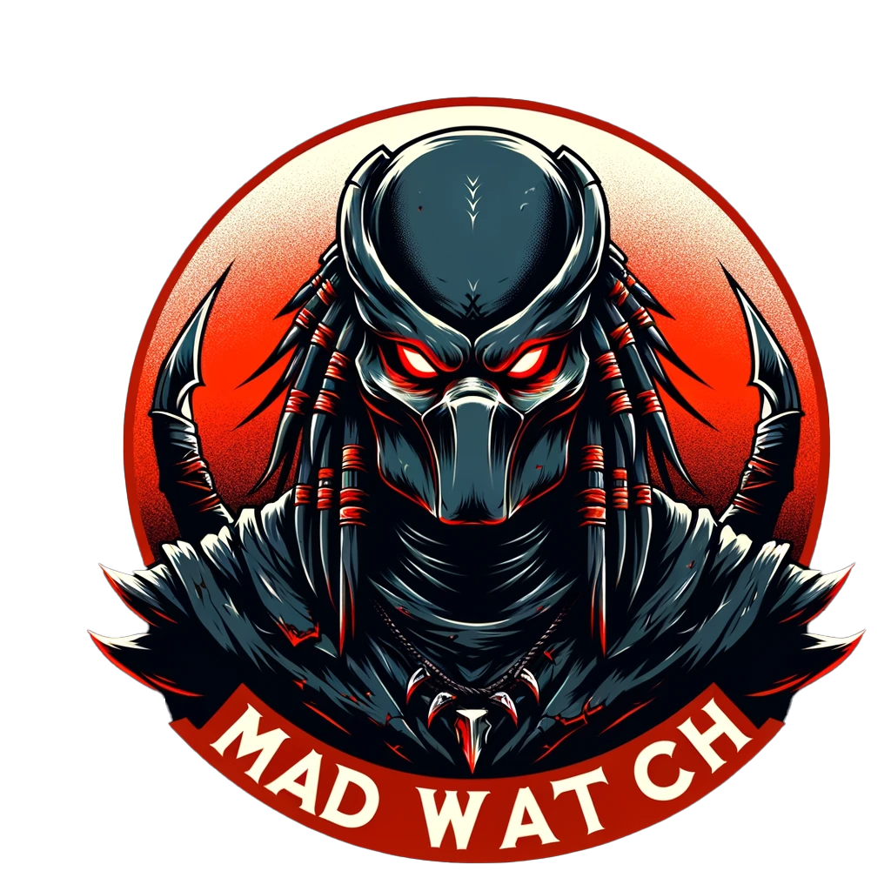

<h2 align="center">

  
DS2_MadWatch
</h2>

Tired of waiting endlessly for that elusive Mad Warrior in Dark Souls 2? 👀

Ready to turn your "Mad Warrior waiting game" into a productive pastime? 🎮⏳

<div align="center">
  
</div>

> _Patience is a virtue, but let's not overdo it._

DS2_MadWatch is here to save your day! An automation tool that notifies you when the Mad Warrior spawns, turning your waits into wins! 🚀

⚠️ **DISCLAIMER:** _Use at your own risk, I'm not responsible for any game-related consequences._

## 📚 Table of Contents

- [How](#-How)
- [Use](#-use-🚀)
- [Contribute](#-contribute-)
- [FAQ](#-faq-frequently-asked-questions)
- [License](#-License-)

## 📖 How

1. **Using the PowerShell Script ⚡**:
   - 🚀 First, let's tackle Windows' default script settings. By default, PowerShell restricts script execution (safety first, right? 🛡️). Here's how to loosen up those settings:
     - Press the Windows key and type 'Windows PowerShell'.
     - Right-click on 'Windows PowerShell' and select 'Run as administrator'.
     - In the PowerShell window, type the following command and hit Enter:
       ```powershell
       Set-ExecutionPolicy RemoteSigned
       ```
     - Confirm with 'Yes' or 'A' (for all) when prompted. This setting allows you to run scripts that are signed or created locally.

   - 🌐 Next, download the `DS2_MadWatch.ps1` script directly:
     - Visit the [DS2_MadWatch Releases page](https://github.com/zkrvf/DS2_MadWatch/releases/).
     - Download the latest `DS2_MadWatch.ps1` file from the releases.
     - Save the script to a known directory on your computer.

   - 🔥 Time to fire up the script:
     - Navigate to the folder containing `DS2_MadWatch.ps1`.
     - Right-click on `DS2_MadWatch.ps1` and choose 'Run with PowerShell'.
     - Sit back and enjoy the magic of automation! 🪄

🎉 There you go! You're all set to track the Mad Warrior like a pro. Happy gaming! 🎮

<div align="center">
  
</div>

Now, sit back and relax while DS2_MadWatch keeps an eye out for the Mad Warrior. When he spawns, you'll know it instantly! ⏲️👀

## 🔧 Use 🚀
Run the script whenever you're in the game, waiting for the Mad Warrior. 🕹️ The script checks every 0.1 seconds for any significant increase in RAM usage by the game 📈, hinting at the spawn of the Mad Warrior. When it detects a spawn, it'll beep 📢 and show a time-stamped notification! 🕒

I recommend playing in windowed mode at a lower resolution to keep an eye on the script 👀. You can also use the Task Manager to monitor RAM usage in real-time. Check out the video below for an example setup! 🖥️🎥

### 📹 Video Demo 🎬
https://github.com/zkrvf/DS2_MadWatch/assets/149688649/d48ea359-b665-4551-b538-f2a689eb9eb2
## ➕ Contribute 🤝

Interested in making DS2_MadWatch even better? Here's how you can help:

1. 🍴 Fork the project.
2. 🌱 Create a new branch (`git checkout -b feature_branch`).
3. ✍️ Commit your changes (`git commit -am 'Add some feature'`).
4. 🚀 Push to the branch (`git push origin feature_branch`).
5. 📬 Open a new Pull Request.

## ❓ FAQ (Frequently Asked Questions)
**Q:** Can this script be modified for other in-game events or games? 🕹️    
**A:** Absolutely! With some tweaks, it can be adapted to monitor various in-game events that affect memory usage. 🛠️ 

**Q:** Does the script sometimes give false positives? 🤔      
**A:** Indeed, you might occasionally hear a beep with no Mad Warrior in sight. It's rare, but hey, a good excuse to stretch those legs! 🏃‍♂️ These false alarms mostly occur after an encounter, before re-sitting at the bonfire.

**Q:** Any tips to increase the encounter rate with the Mad Warrior? 🎯      
**A:** Sure thing! Equip these for better odds:    
   - Symbol of Avarice 🗿
   - Covetous Gold Serpent Ring +2 💍
   - Watchdragon Parma 🛡️
   - Prisoner's Set 👕
   - Rusted Coin 🪙

Gear up and increase your chances! 🚀

## 📝 License 📜
The software is licensed under the [GNU General Public License v3.0](https://www.gnu.org/licenses/gpl-3.0.en.html).
